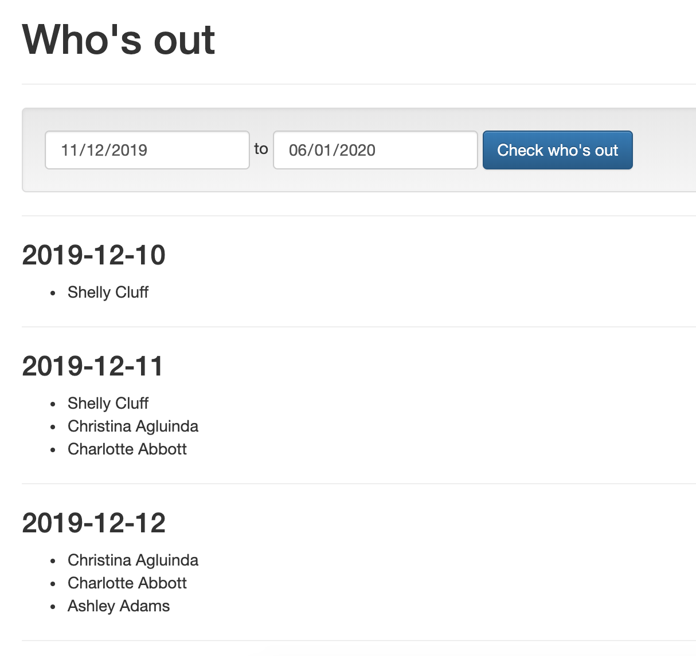

# bamboohr-time-off

Reads data from BambooHR API and plot it in a calendar / table view to see 
who's out and when.

## Run the project

* Create a `.env` file using `.env.example` as reference and put the right values.
* `php -S localhost:8000 -t web/`